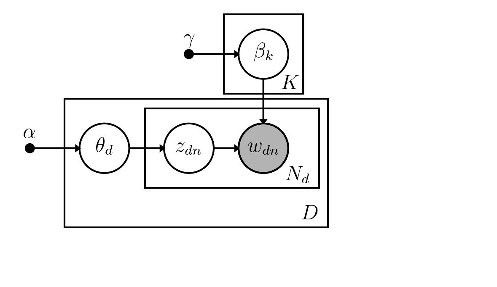
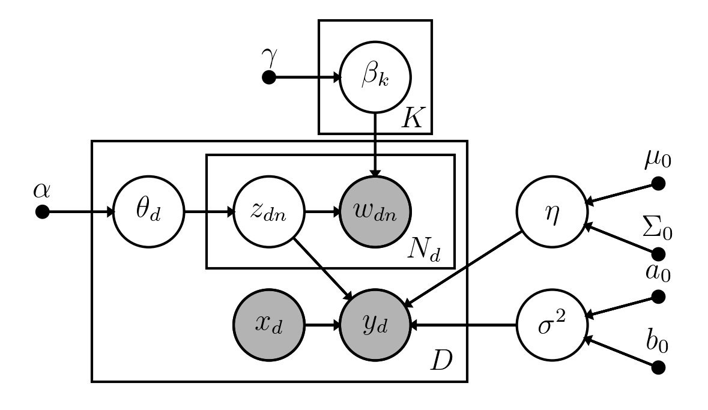
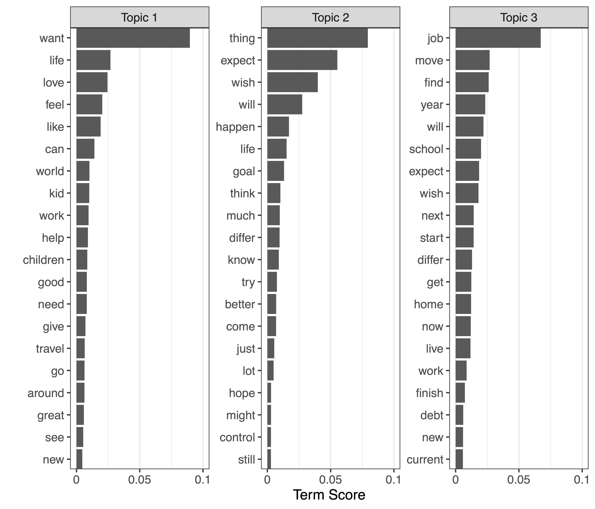

```{r xaringan-themer, include = FALSE, warning = FALSE}
library(xaringanthemer)
# Color codes from Nord theme: https://www.nordtheme.com
style_mono_light(
  base_color       = "#2E3440",
  # secondary_color     = "#81A1C1",
  header_font_google  = google_font("Fira Sans", "400"),
  header_h1_font_size = "2.25rem",
  header_h2_font_size = "1.75rem",
  header_h3_font_size = "1.5rem",
  text_font_google    = google_font("Fira Sans", "300", "300i"),
  text_font_size      = "1.25rem", 
  code_font_google    = google_font("Fira Code Retina"),
  header_background_auto = TRUE
)
options(crayon.enabled = TRUE)
```

```{r, load_refs, include = FALSE, cache = FALSE}
library(RefManageR)
BibOptions(check.entries = FALSE,
           bib.style = "authoryear",
           cite.style = "authoryear",
           max.names = 1,
           style = "text",
           hyperlink = TRUE,
           longnamesfirst = FALSE,
           sorting = "nyt",
           dashed = FALSE,
           no.print.fields = "issn")
myBib <- ReadBib("sLDAX\ Paper.bib", check = FALSE)
gsea <- function(string) gsub("(,\\set\\sal\\.)", " et al.", string)
```

```{r packages, include=FALSE, message=FALSE}
library(tidyverse)
library(icon)
```

```{r setup, include=FALSE}
options(htmltools.dir.version = FALSE)
```

# Text Data in Psychology
+ Text is an increasingly popular data source
  + Social media `r gsea(Citep(myBib, "schwartz2013personality"))`
  + Open-ended questions `r gsea(Citep(myBib, "Popping2015"))`
  + Medical health records `r gsea(Citep(myBib, "obeid2019automated"))`

+ Various overviews exist on existing text mining algorithms for psychological research `r gsea(Citep(myBib, c("Finch2018", "Iliev2015", "Kjell2019", "Rohrer2017")))`

+ These algorithms are often designed for massive data sets uncommon in psychology

+ Current challenge is to adapt these algorithms to psychological research

---

# Modeling Text as Data

.pull-left[
## Top Down
+ Dictionary methods
  + LIWC `r gsea(Citep(myBib, "Tausczik2010a"))`
  + Sentiment analysis
+ Usable (in theory) with any data

+ Dictionaries may not be valid for given data
]
.pull-right[
## Bottom Up
+ Qualitative analysis
  + Considered the gold standard
  + Time-consuming and expensive
  + Cannot be easily applied to new data
+ Quantitative models
  + More complex
  + Faster and cheaper
  + Reusable with new data
]

???

+ Let the data speak
+ Model-based dictionaries and models
  + Matrix factorization [@Deerwester1990; @Kjell2019]
  + Neural networks [@Deng2018]
  + Topic models [LDA; @Blei2003; @Rohrer2017]

---

class: center

# Topic Modeling



---

# Latent Dirichlet Allocation (LDA)

.pull-left[
Seminal topic model `r gsea(Citep(myBib, "Blei2003"))`

$$L(\vec{\Theta}, \vec{B}) = \prod_{d=1}^D \prod_{n=1}^{N_d} \beta_{z_{dn}, w_{dn}} \theta_{d, z_{dn}}$$
]
.pull-right[
Topics: $\vec{\beta}_k = \text{Pr}\left[ w_{dn} = m | z_{dn} = k \right]$
$\vec{\beta}_k \sim \text{Dir}(\vec{\gamma})$

Topic proportions: $\vec{\theta}_d = \text{Pr}\left[ z_{dn} = k \right]$
$\vec{\theta}_d \sim \text{Dir}(\vec{\alpha})$

Topic assignments: $\left(z_{dn} | \vec{\theta}_d\right) \sim \text{Cat}(\vec{\theta}_d)$

Words: $\left(w_{dn} | z_{dn} = k, \vec{\beta}_k\right) \sim \text{Cat}(\vec{\beta}_k)$
]

???

+ Represent corpus with probability model of K topics and common vocabulary
  + Let each doc. have its own topic proportions
+ Computationally easier to estimate due to conditional independence assumptions
+ More complex dependency structures exist (CTM, HTMM) but harder to fit
+ Can be readily extended to more complex models

---

# Fusing Topic Models and Regression


+ Two-stage approach `r gsea(Citep(myBib, c("Packard2020", "Rohrer2017")))`
    + Use estimated $\vec{\Theta}$ to predict $Y$
    + Could include other manifest predictors $\vec{X}$
+ One-stage approach
    + Supervised topic model `r gsub(";\\s\\(", "; ", paste("(SLDA;", gsea(Citep(myBib, "Blei2010"))))`
    + Does not include $\vec{X}$
+ We propose the SLDAX model
  + One-stage approach
  + Allow topics and manifest predictors of $Y$

???

+ Analogous to estimated factors scores vs. SEM
+ Will show by simulation that one-stage approach is needed
  + Major estimation bias with two-stage
+ For topics as outcomes, see structural topic model `r gsea(Citep(myBib, "Roberts2016"))`

---

# SLDAX



---

# Gibbs Sampler for $Y | \cdot \sim \text{N}(\cdot)$

+ $f\left(z_{d,n} = k | \cdot\right) \propto \exp\left\{ -\frac{1}{2\sigma^2} \left(y_d - \left(\vec{\bar{z}}_d, \vec{x}_d\right)' \vec{\eta} \right)^2\right\} \times$
   $\hspace{67pt}\left(n_{dk}^{(-n)} + \alpha\right) \left(\frac{n_{kv}^{(-n)} + \gamma}{n_{k}^{(-n)} + V\gamma}\right)$
+ $f\left(\sigma^2 | \cdot\right) = \text{IG}\left(\frac{a_0 + D}{2}, \frac{1}{2} \left( b_0 + \sum_d \left[y_d - \left(\vec{\bar{z}}_d, \vec{x}_d\right)' \vec{\eta} \right]^2 \right) \right)$
+ $f\left(\vec{\eta} | \cdot\right) = \text{N}\left(\vec{\eta}_1, \vec{\Sigma}_1 \right)$
    + $\vec{\Sigma}_1 = \left( \vec{\Sigma}_0^{-1} + \sigma^{-2} \left(\vec{\bar{Z}}, \vec{X}\right)' \left(\vec{\bar{Z}}, \vec{X}\right) \right)^{-1}$
    + $\vec{\eta}_1 = \vec{\Sigma}_1 \left( \vec{\Sigma}_0^{-1} \vec{\mu}_0 + \sigma^{-2} \left(\vec{\bar{Z}}, \vec{X}\right)' \vec{y} \right)$

???

+ Label switching handled by `r Citep(myBib, "Stephens2000")`

---

# MH-in-Gibbs for $Y | \cdot \sim \text{Ber}(\cdot)$

+ $f\left(z_{dn} = k | \cdot \right) \propto \frac{\exp \left\{ y_d \left(\vec{\bar{z}}_d, \vec{x}_d\right)' \vec{\eta} \right\}} { 1 + \exp \left\{ \left(\vec{\bar{z}}_d, \vec{x}_d\right)' \vec{\eta} \right\}} \left(n_{dk}^{(-n)} + \alpha\right) \left(\frac{n_{kv}^{(-n)} + \gamma}{n_{k}^{(-n)} + V\gamma}\right)$
+ $f\left(\vec{\eta} | \cdot\right) \propto \prod_d \left[ \frac{\exp \left\{ y_d \left(\vec{\bar{z}}_d, \vec{x}_d\right)' \vec{\eta} \right\}} { 1 + \exp \left\{ \left(\vec{\bar{z}}_d, \vec{x}_d\right)' \vec{\eta} \right\}} \right] \times$
   $\hspace{40pt} \exp\left\{-\frac{1}{2} \left( \vec{\eta} - \vec{\mu}_0 \right)' \vec{\Sigma}_0^{-1} \left( \vec{\eta} - \vec{\mu}_0 \right) \right\}$
  + Use Metropolis-Hastings algorithm to sample
  + Independent proposal distributions
      + $\eta_j \sim \text{N}\left(\mu_j, \tau_j \right)$
      + Tune $\tau_j$ during burn-in

???

+ $\tau_j^{(0)}$ = 2.38 based on `r gsea(Citep(myBib, "Roberts1997"))` yields AR $\approx$ 0.24
+ Could use t-dist. proposals

---

# Software
+ `psychtm` R package in early development (not quite user-friendly yet)

+ Features
  + LDA, SLDA, SLDAX MCMC algorithms implemented in `C++`
      + Normal and dichotomous outcomes supported
  + Estimation and visualization of $\vec{\Theta}$ and $\vec{B}$
  + Model selection by WAIC `r gsea(Citep(myBib, "Watanabe2010"))`

+ [Available from Github `r icon::fa("github")`](https://github.com/ktw5691/psychtm)

```{r, eval = FALSE}
devtools::install_github("ktw5691/psychtm")
```

---

# Simulation Study
## Goal
+ Compare SLDAX with two-stage approach (LDA + OLS regression)
  + SLDAX from our R package [`psychtm`](https://github.com/ktw5691/psychtm)
  + LDA model from R package `topicmodels`
+ Conditions
  + \# topics $K$: 2 and 5
  + \# documents $D$: 200, 800, and 1500
  + Mean \# words $\bar{N}_d$: 15, 80, and 150
  + Vocabulary $V$: 500 and 1000

---

# Simulation Study
## Data Generation
+ SLDAX model
  + One manifest predictor $X \sim \text{N}(0, 1)$
  + Outcome $Y \sim \text{N}(\cdot)$
+ Regression coefficient for $X$ had partial $R^2$ = .15
+ Topic regression coefficients had joint partial $R^2$ = .35

## Estimation
+ SLDAX with flat priors
+ LDA with same hyper-parameters
  + Estimated by Blei et al.'s (2003) variational EM algorithm
  + OLS regression

???

+ SLDAX MCMC
  + Posterior sample of 3000
  + Burn in of of 5000
  + Thinning period of 10
  + Convergence rates for SLDAX averaged 90\% using Geweke statistic
+ VEM
  + 500 E-step max
  + 1000 M-step max
  + Tolerance of E-6 in log-likelihood

---

# Two-Stage Estimation Bias for $\eta_{\bar{z}}$

```{r, echo = FALSE, message = FALSE, cache = TRUE}
files <- list.files("../sldax-paper/paper-sim-test/results/", pattern = "^condition-test\\d+",
                    full.names = TRUE)
dat <- files %>% lapply(read_csv, n_max = 1500, progress = FALSE)
dat_sldax <- dat %>% bind_rows()

files_vem <- list.files("../sldax-paper/paper-sim-test/results/", pattern = "vem",
                        full.names = TRUE)
dat_vem <- files_vem %>% lapply(read_csv, n_max = 1500, progress = FALSE)
dat_vem <- dat_vem %>% bind_rows()
dat_all <- bind_rows(list("sldax" = dat_sldax, "vem" = dat_vem), .id = "model")

geweke_local_converge <- function(x) mean(if_else(abs(x) < 1.96, 1, 0))
geweke_global_converge <- function(x, zc = 1.96) abs(x) < zc

dat_wide <- dat_all %>%
  pivot_wider(id_cols = model:ntopic, names_from = param, values_from = geweke_z, names_repair = "unique")
dat_filtergc <- dat_wide %>%
  mutate(converge_all = case_when(
    ntopic == 5 ~ geweke_global_converge(x, 2.69) & geweke_global_converge(t1, 2.69) &
      geweke_global_converge(t2, 2.69) & geweke_global_converge(t3, 2.69) &
      geweke_global_converge(t4, 2.69) & geweke_global_converge(t5, 2.69) &
      geweke_global_converge(sigma2, 2.69),
    ntopic == 2 ~ geweke_global_converge(x, 2.5) & geweke_global_converge(t1, 2.5) &
      geweke_global_converge(t2, 2.5) & geweke_global_converge(sigma2, 2.5))) %>% 
  filter(model == "vem" | (model == "sldax" & converge_all)) %>% 
  select(-converge_all)

rbias_results <- dat_all %>% 
  semi_join(dat_filtergc %>% select(model:ntopic)) %>% 
  filter(!near(pop, 0.0)) %>% 
  group_by(model, param, ndoc, nvocab, avg_len, ntopic) %>%
  summarise(n = n(),
            avg_relbias = 100 * mean(relbias),
            se_relbias = sd(100 * relbias) / sqrt(n)) %>% 
  ungroup()

gg_rbias <- rbias_results %>%
  # 
  filter(param == "t1", model == "vem") %>% 
  # mutate(model = factor(model, levels = c("sldax", "vem"), labels = c("SLDAX", "2-Stage"))) %>% 
  # group_by(model, ndoc, ntopic, avg_len) %>% 
  group_by(ndoc, ntopic, avg_len) %>% 
  summarise(avg_relbias = mean(avg_relbias)) %>% 
  # ggplot(aes(ndoc, avg_relbias, group = interaction(model, ntopic), shape = factor(ntopic), linetype = factor(model))) +
  ggplot(aes(ndoc, avg_relbias, shape = factor(ntopic))) +
  geom_point(position = position_dodge(75), size = 3) +
  geom_line(position = position_dodge(75)) +
  ylab("Relative Bias (%)") +
  xlab("# Documents") +
  scale_x_continuous(labels = c(200, 800, 1500),
                     breaks = c(200, 800, 1500)) +
  scale_y_continuous(labels = c(-100, 100, seq(500, 2000, 500)),
                     breaks = c(-100, 100, seq(500, 2000, 500))) +
  # scale_linetype_discrete(name = "Model") +
  scale_shape_discrete(name = "# Topics") +
  facet_wrap(~ avg_len, nrow = 1) +
  geom_hline(yintercept = 0, linetype = "dashed") +
  theme(panel.grid.major.x = element_blank(),
        panel.grid.minor.x = element_blank(),
        panel.grid.minor.y = element_blank(),
        legend.position = "top",
        axis.text.x = element_text(angle = 45, hjust = 1))
```

```{r, echo=FALSE, message=FALSE, fig.showtext=TRUE, fig.retina=2, fig.asp=0.625, out.width=800, dpi=600}
gg_rbias + theme_xaringan(text_font_size = 24)
```

???

+ Bias for topic coefs. gets worse with more data!
  + Worse with more topics / complex model
+ Bias of X coef. was ignorable in all conditions
+ Same results using Gibbs instead of VEM

---

# SLDAX Estimation Bias for $\eta_{\bar{z}}$

```{r, echo=FALSE, message=FALSE, cache = TRUE}
gg_rbias2 <- rbias_results %>%
  # filter(param == "t1") %>% 
  filter(param == "t1", model == "sldax") %>%
  # mutate(model = factor(model, levels = c("sldax", "vem"), labels = c("SLDAX", "2-Stage"))) %>% 
  # group_by(model, ndoc, ntopic, avg_len) %>% 
  group_by(ndoc, ntopic, avg_len) %>% 
  summarise(avg_relbias = mean(avg_relbias)) %>% 
  # ggplot(aes(ndoc, avg_relbias, group = interaction(model, ntopic), shape = factor(ntopic), linetype = factor(model))) +
  ggplot(aes(ndoc, avg_relbias, shape = factor(ntopic))) +
  geom_point(position = position_dodge(75), size = 3) +
  geom_line(position = position_dodge(75)) +
  ylab("Relative Bias (%)") +
  xlab("# Documents") +
  scale_x_continuous(labels = c(200, 800, 1500),
                     breaks = c(200, 800, 1500)) +
  scale_y_continuous(labels = c(-100, 100, seq(-100, 100, 50)),
                     breaks = c(-100, 100, seq(-100, 100, 50))) +
  # scale_linetype_discrete(name = "Model") +
  scale_shape_discrete(name = "# Topics") +
  facet_wrap(~ avg_len, nrow = 1) +
  geom_hline(yintercept = 0, linetype = "dashed") +
  theme(panel.grid.major.x = element_blank(),
        panel.grid.minor.x = element_blank(),
        panel.grid.minor.y = element_blank(),
        legend.position = "top",
        axis.text.x = element_text(angle = 45, hjust = 1))
```

```{r, echo=FALSE, message=FALSE, fig.showtext=TRUE, fig.retina=2, fig.asp=0.625, out.width=800, dpi=600}
gg_rbias2 + theme_xaringan(text_font_size = 24)
```

???

+ Longer documents most important
  + Worse with more topics / complex model
+ Shrinkage
+ Bias of X coef. was ignorable in all conditions

---

# Bias: Two-Stage vs. SLDAX

```{r, echo=FALSE, message=FALSE, cache=TRUE}
gg_rbias3 <- rbias_results %>%
  filter(param == "t1") %>% 
  mutate(model = factor(model, levels = c("sldax", "vem"), labels = c("SLDAX", "2-Stage"))) %>%
  group_by(model, ndoc, ntopic, avg_len) %>%
  summarise(avg_relbias = mean(avg_relbias)) %>% 
  ggplot(aes(ndoc, avg_relbias, group = interaction(model, ntopic), shape = factor(ntopic), linetype = factor(model))) +
  geom_point(position = position_dodge(75), size = 3) +
  geom_line(position = position_dodge(75)) +
  ylab("Relative Bias (%)") +
  xlab("# Documents") +
  scale_x_continuous(labels = c(200, 800, 1500),
                     breaks = c(200, 800, 1500)) +
  scale_y_continuous(labels = c(-100, 100, seq(500, 2000, 500)),
                     breaks = c(-100, 100, seq(500, 2000, 500))) +
  scale_linetype_discrete(name = "Model") +
  scale_shape_discrete(name = "# Topics") +
  facet_wrap(~ avg_len, nrow = 1) +
  geom_hline(yintercept = 0, linetype = "dashed") +
  theme(panel.grid.major.x = element_blank(),
        panel.grid.minor.x = element_blank(),
        panel.grid.minor.y = element_blank(),
        legend.position = "top",
        axis.text.x = element_text(angle = 45, hjust = 1))
```

```{r, echo=FALSE, message=FALSE, fig.showtext=TRUE, fig.retina=2, fig.asp=0.625, out.width=800, dpi=600}
gg_rbias3 + theme_xaringan(text_font_size = 24)
```

---

# Illustrative Example

+ 882 adults recruited on MTurk
+ $Y$: Beck Hopelessness Scale `r gsea(Citep(myBib, "Beck1989"))`
+ Open-ended free response question
  + "What are your expectations for the future?"
  + Median response length was 44 words (*M* = 50, *SD* = 24, *Range* = 5 &ndash; 186)
  + After stopword removal and stemming:
      + Median length was 18 words (*M* = 21, *SD* = 10, *Range* = 2 &ndash; 76)
      + Vocabulary of 3096 stems (98% of original vocabulary)
+ Manifest predictors
  + Depression Anxiety Stress Scales `r gsea(Citep(myBib, "Lovibond1995"))`
  + Age (*M* = 33, *SD* = 10, *Range* = 18 &ndash; 79)

???

+ BHS sum score ($M$ = 9.7, $SD$ = 2.3, Range = 3 &ndash; 20)
+ 3 DASS subscales sum score ($M$ = 16.9, $SD$ = 14.5, Range = 0 &ndash; 63)
+ Relationship of the DASS scores and themes in the future expectations responses with hopelessness
  + SLDAX model predicting BHS scores with DASS scores and $K$ topics while adjusting for age
  + BHS, DASS, and age were standardized

+ MVN(0, I) prior for manifest $\eta$
+ MVN prior for topics $\eta$, we used different prior means for each topic centered around zero to help identify the model
  + $\mu_0 = \left\{-0.5, 0, 0.5 \right\}$
      + A priori average effects of the topics between -5 and 5
+ IG(5, 3) prior for $\sigma^2$
  + Prior mean of 0.75 and SD of 0.4
  + BHS standardized, so $\sigma^2 \le 1$
+ $\theta_d \sim Dir(1)$
  + Flat prior over the $K$-dimensional simplex
+ $\beta_k \sim Dir(1)$
+ Results were robust to less informative priors
+ Convergence was evaluated using trace plots and the Geweke (1992) and Heidelberger (1983) statistics
+ Burn-in of 15,000 iterations
+ Total of 22,500 iterations
+ 7,500 posterior samples
+ The posterior samples were permuted using Stephens (2000) label switching algorithm

---

# Regression Estimates

.center[
```{r emp-example, message=FALSE, echo=FALSE, cache=TRUE}
empdat <- tibble(var = c("Age", "DASS", "Effect T1", "Effect T2", "Effect T3"),
                 est = c(-0.02, 0.44, -0.16, -0.14, 0.30),
                 lcl = c(-0.08, 0.38, -0.42, -0.39, 0.02),
                 ucl = c(0.04, 0.50, 0.10, 0.10, 0.59))
gg_coef <- empdat %>% 
  ggplot(aes(var, est)) +
  geom_point(size = 3) +
  geom_errorbar(aes(ymin = lcl, ymax = ucl), size = 1, width = 0.5) +
  xlab("") +
  ylab("") +
  theme(panel.grid.major.x = element_blank(),
        panel.grid.minor.x = element_blank(),
        panel.grid.minor.y = element_blank(),
        legend.position = "top",
        axis.text.x = element_text(angle = 45, hjust = 1))
```

```{r, echo=FALSE, message=FALSE, fig.showtext=TRUE, fig.retina=2, fig.asp=0.625, out.width=650, dpi=600}
gg_coef + theme_xaringan(text_font_size = 24)
```
$\text{Effect} = \hat{\eta}_k - K^{-1} \sum_{j \ne k}^K \hat{\eta}_j$
]

---

# Topic Estimates
.center[

]

???

+ Topic 1: positive hopes involving family, work, and travel
  + "find ways to improve my relationships ... help my children learn and grow into good people."
+ Topic 2: general optimism
  + "my life will get better ... I understand that might be different from what I get."
+ Topic 3: concerns about career, education, home location, and debt
  + "I look forward to paying off the last of my credit card debt ... I wish to find an apartment and job close to my son's school in the same city."
  + Associated with higher BHS

---

# Conclusions
+ Hopelessness in responses associated with BHS
  + Convergent validity for topics
  + Text topics associated with BHS above and beyond DASS

+ Topic effects may be attenuated based on simulation results
  + Large $D$, small $\bar{N}_d$

+ Could predict on new data or update model using new data

---

# Discussion
## Key Findings
+ The popular two-stage approach yields dramatically biased estimates of regression coefficients
+ SLDAX yields much more accurate estimates and provides shrinkage under small-data scenarios
+ We derived MCMC algorithms to estimate SLDAX models
+ We implemented SLDAX models in open-source `R` package

## Future Work
+ SLDAX framework can be generalized
  + Integration with SEM 
  + Longitudinal / EMA data
+ Impact of text data quality on performance

---

# Thanks!

.center[
### `r icon::fa("paper-plane")` kwilcox3@nd.edu
### [`r icon::ii("earth")` ktylerwilcox.netlify.app](https://ktylerwilcox.netlify.app)
### [`r icon::fa("github")` @ktw5691](http://github.com/ktw5691)
### [`r icon::fa("link")` Slides](https://ktylerwilcox.netlify.app)
]

---

# References

```{r bib, echo = FALSE, results = "asis"}
get_doi <- function(paper) {
  if (is.null(paper$doi)) {
    ""
  } else{
    paste0(" https://doi.org/", paper$doi)
  }
}
apa_style <- tools::bibstyle("apa", sortKeys = function(refs) seq_along(refs),
    # fmtPrefix = function(paper) paste0("[^", attr(paper,"key"), "]:"),
    extraInfo = function(paper) paste0(get_doi(paper)), .init = TRUE)
RefManageR::PrintBibliography(myBib, .opts = list(bib.style = "apa", sorting = ""), start = 1, end = 4)
```

---

```{r bib2, echo = FALSE, results = "asis"}
RefManageR::PrintBibliography(myBib, .opts = list(bib.style = "apa", sorting = ""), start = 5, end = 7)
```

---

```{r bib3, echo = FALSE, results = "asis"}
RefManageR::PrintBibliography(myBib, .opts = list(bib.style = "apa", sorting = ""), start = 8, end = 10)
# TODO: Check for warning about out of bounds subscript and adjust `end = `
```

---

```{r bib4, echo = FALSE, results = "asis"}
RefManageR::PrintBibliography(myBib, .opts = list(bib.style = "apa", sorting = ""), start = 11, end = 13)
# TODO: Check for warning about out of bounds subscript and adjust `end = `
```

---

```{r bib5, echo = FALSE, results = "asis"}
RefManageR::PrintBibliography(myBib, .opts = list(bib.style = "apa", sorting = ""), start = 14, end = 16)
# TODO: Check for warning about out of bounds subscript and adjust `end = `
```

---

```{r bib6, echo = FALSE, results = "asis"}
RefManageR::PrintBibliography(myBib, .opts = list(bib.style = "apa", sorting = ""), start = 17, end = 17)
# TODO: Check for warning about out of bounds subscript and adjust `end = `
```
